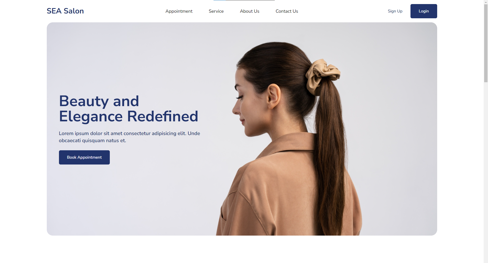

# SEA Salon

Introducing SEA Salon, a rising star in the salon industry known for their outstanding services and excellent reviews.



## Requirements

- Node >= 18.0

## Setup and Installation

Clone this project

```
git clone https://github.com/al-farise/SEA-Salon-Compfest-Task.git sea-salon
```

Change to project directory and install dependencies

```
cd sea-salon
npm install
```

Then run the project

```
npm run dev
```

## Credits

- src/assets/images/image_1.jpg - <a href="https://www.freepik.com/free-photo/side-view-woman-posing-studio_33754696.htm#fromView=search&page=1&position=7&uuid=5763abba-f38c-4617-b648-c744786fdb0c">Image by freepik</a>

- src/assets/images/image_3.jpg - <a href="https://www.freepik.com/free-photo/beautiful-woman-getting-her-hair-cut-home-by-hairdresser_12060052.htm#fromView=search&page=1&position=40&uuid=f4467925-8fd4-44b1-9da9-fec537500192">Image by freepik</a>

- src/assets/images/image_2.jpg - <a href="https://www.freepik.com/free-photo/sideways-portrait-man-getting-haircut_4967156.htm#fromView=search&page=1&position=33&uuid=f4467925-8fd4-44b1-9da9-fec537500192">Image by freepik</a>
